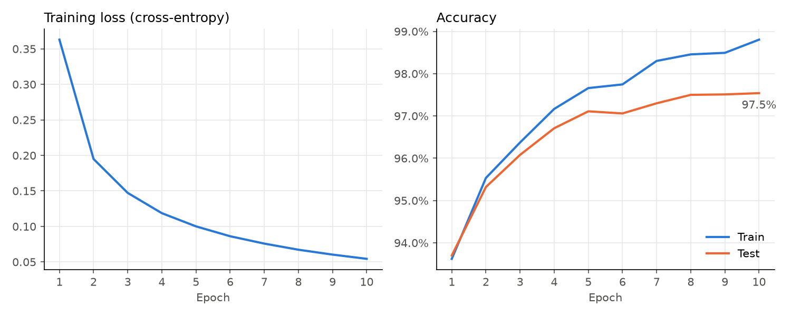

# Neural Networks from Scratch

Two projects built from first principles to understand how modern language models work:

1. **[Part 1 – NumPy MLP](part1_numpy/):** a multi-layer perceptron with hand-derived backpropagation, trained on MNIST using only NumPy.
2. **[Part 2 – Character-level GPT](part2_gpt/):** a decoder-only transformer in PyTorch, trained on Tiny Shakespeare.

## Results

| Project | Metric | Result |
|---|---|---|
| NumPy MLP (784 → 128 → 10) | MNIST test accuracy | **97.5%** |
| Char-level GPT (CPU preset) | Validation loss | _TBD_ |
| Char-level GPT (GPU preset) | Validation loss | _TBD_ |



<!-- Add the GPT loss curve and a generated text sample here once Part 2 trains. -->

## Setup

```bash
python -m venv .venv
.venv\Scripts\activate          # Windows
# source .venv/bin/activate     # macOS / Linux

# Optional: CUDA build of PyTorch for NVIDIA GPUs
pip install torch --index-url https://download.pytorch.org/whl/cu128

pip install -r requirements.txt
```

## Usage

```bash
# Part 1
python part1_numpy/train.py

# Part 2
python part2_gpt/scripts/download_data.py
python part2_gpt/train.py --config cpu      # presets: debug, cpu, gpu, large (see part2_gpt/config.py)
python part2_gpt/sample.py --config cpu --prompt "ROMEO:" --temperature 0.8

# Tests
pytest
```

## Project structure

```
part1_numpy/    NumPy MLP: layers, gradient check, training loop
part2_gpt/      PyTorch GPT: tokenizer, model, training, sampling
assets/         Plots and generated samples used in the READMEs
```

## What I learned

_TBD: key insights, surprises and bugs worth remembering._

## References

- Andrej Karpathy, [Let's build GPT: from scratch, in code, spelled out](https://www.youtube.com/watch?v=kCc8FmEb1nY)
- Andrej Karpathy, [nanoGPT](https://github.com/karpathy/nanoGPT)
- Vaswani et al., [Attention Is All You Need](https://arxiv.org/abs/1706.03762) (2017)
- CS231n, [Backpropagation notes](https://cs231n.github.io/optimization-2/)

## License

[MIT](LICENSE)
