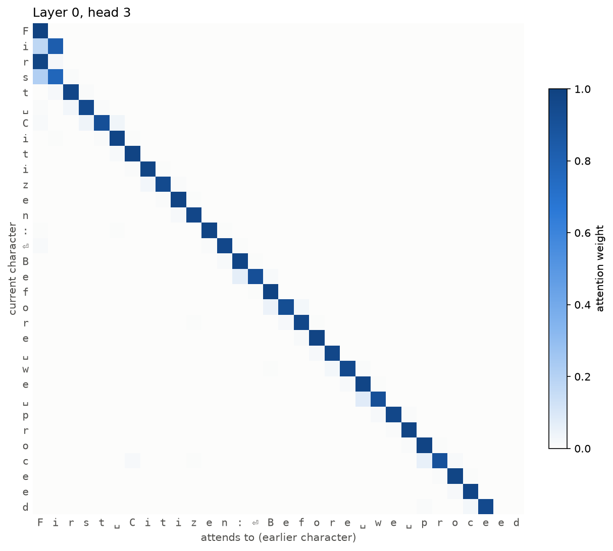
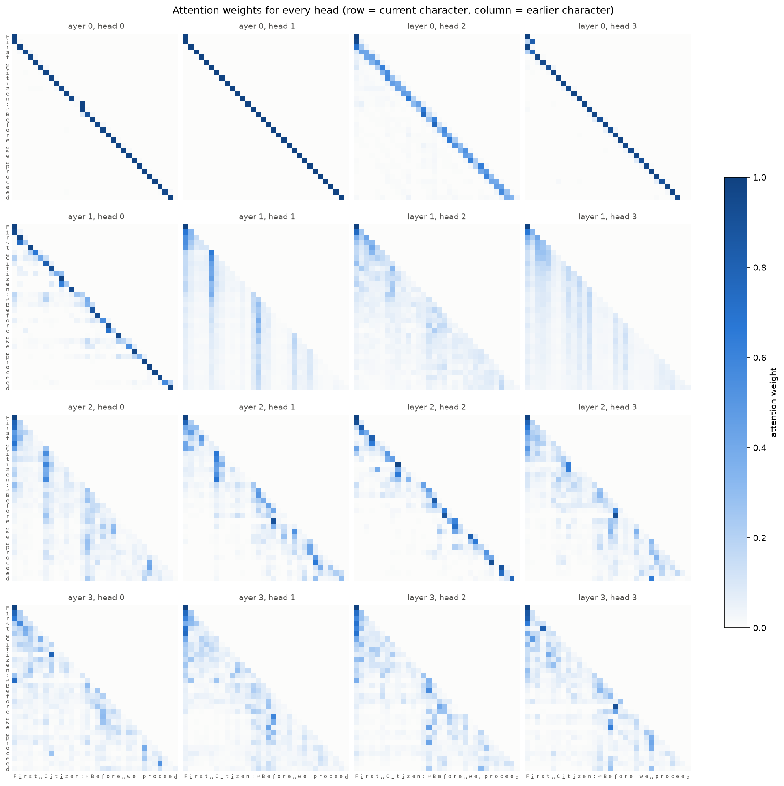
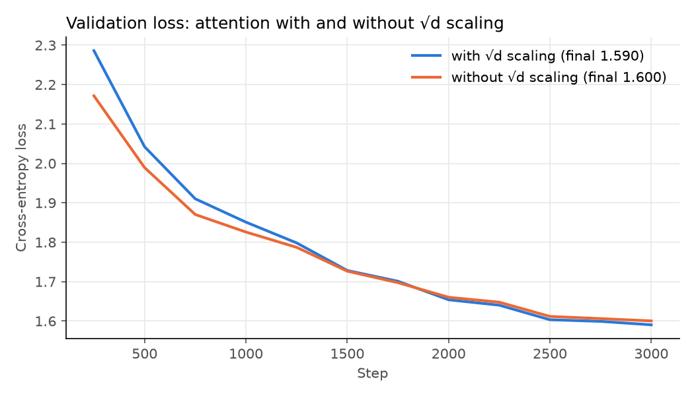

# Part 2 – Character-level GPT in PyTorch

A decoder-only transformer trained on [Tiny Shakespeare](https://github.com/karpathy/char-rnn/tree/master/data/tinyshakespeare) (1.1M characters) to generate text one character at a time. Built up step by step, starting from a bigram baseline.

## Results

| Model | Parameters | Context | Validation loss | Training time* |
|---|---|---|---|---|
| Random guessing | – | – | 4.17 (= ln 65) | – |
| Bigram baseline | 4,225 | 1 character | 2.50 | 15 s |
| GPT, `cpu` preset | 0.8M | 64 characters | 1.59 | 3 min |
| GPT, `gpu` preset | 3.3M | 256 characters | **1.51** | 14 min |

<sub>*On a laptop GeForce MX550 (2 GB).</sub>


### Sample

From the `gpu` preset at the end of training (temperature 1.0):

```
On is truesty time, to the suit of steem;
Proved the couldey that standery for the fleere but of
We will posses, may constr, willieve undertain brunce
Can thou cert overy, men, on denying and powely:
Would he sought in y thing conscqual to golden-roor.

BUCKINGHARDINE:
Gester, I did-not gine own,
```

The bigram model, which only sees one character, produces word-shaped gibberish (`Wanthar u qur, vet?`). With attention, the model spells most words correctly, invents plausible speaker names, and keeps the rhythm of verse, though the text doesn't mean anything yet.

## Architecture

```
character ids
  → token embedding + position embedding
  → N × Block:
        x = x + MultiHeadAttention(LayerNorm(x))   # gather information from earlier characters
        x = x + FeedForward(LayerNorm(x))          # process it at each position
  → LayerNorm → Linear → scores for the next character
```

| Piece | What it does |
|---|---|
| **Tokenizer** ([`tokenizer.py`](tokenizer.py)) | Maps each of the 65 distinct characters to an id. Targets are the inputs shifted one character left. |
| **Causal self-attention** ([`model.py`](model.py) `Head`) | `softmax(Q·Kᵀ / √d + mask) · V`. Each position scores every earlier position by how well its query matches their key, then takes a weighted average of their values. The mask stops it seeing the future. |
| **Scaling by √d** | Keeps dot products small so softmax doesn't saturate into all-or-nothing weights with vanishing gradients. |
| **Multi-head attention** | Several smaller heads side by side, each free to learn a different pattern. |
| **Position embeddings** | Attention is order-blind (a weighted average), so each position gets a learned vector added to it. |
| **Feed-forward** | `Linear → GELU → Linear` applied to each position independently. |
| **Residual connections + pre-LayerNorm** | Each sub-layer adds a correction to `x` rather than replacing it, giving gradients a direct path through deep stacks. |

## Training

- **AdamW**, with weight decay on weight matrices only (not biases or LayerNorm)
- **Learning rate**: linear warmup over 100 steps, then cosine decay from 1e-3 to 1e-4
- **Gradient clipping** at norm 1.0
- **Dropout** 0.2 (`gpu` and `large` presets)
- **Checkpointing**: the model with the best validation loss is saved

Sanity checks, all in [`tests/test_model.py`](tests/test_model.py): the untrained model's loss is ≈ ln(65); changing a character never changes predictions for earlier positions; generation works past the context length.

## Presets

Defined in [`config.py`](config.py):

| Preset | Layers | Heads | Embedding | Context | Batch | Steps |
|---|---|---|---|---|---|---|
| `debug` | 1 | 2 | 16 | 8 | 4 | 100 |
| `cpu` | 4 | 4 | 128 | 64 | 32 | 3,000 |
| `gpu` | 4 | 4 | 256 | 256 | 16 | 5,000 |
| `large` | 6 | 6 | 384 | 256 | 16 | 5,000 |

## Experiments

### What does each attention head look at?



Each row is a character and each column is an earlier character it can attend to; darker means more attention. This head (layer 0, head 3) almost always looks exactly **two characters back**.

Measured on real validation text ([`scripts/attention_stats.py`](scripts/attention_stats.py) `--per-head`), the `gpu` model's 16 heads show clear specialisations:

- **Layer 0 builds local context.** Head 0 puts 93% of its attention on the previous character, head 1 puts 97% there, and head 3 puts 94% on the character two back.
- **Layer 1 looks far back.** Heads 1 and 3 spread their attention widely, reaching on average about 70 characters back.
- **Some later heads track word and line breaks.** Layer 2 head 3 and layer 3 head 2 put about 40% of their attention on spaces and newlines, which make up only 19% of the text.

<details>
<summary>All 16 heads</summary>



</details>

### Is the √d in attention actually needed?

Attention divides its scores by √(head size) before the softmax. The usual explanation: without it, dot products grow with the head size, the softmax becomes nearly one-hot, and gradients vanish. I trained the `cpu` preset with and without the scaling (`train.py --no-attn-scale`):



| | Final val loss | Average max attention weight | Attention entropy |
|---|---|---|---|
| With √d scaling | **1.590** | 0.45 | 1.77 nats |
| Without √d scaling | 1.600 | 0.60 | 1.28 nats |

**Removing it barely mattered here.** The model without scaling even learned faster at first, and finished only 0.01 worse. It did end up with noticeably **sharper attention** (the largest weight in each row averaged 0.60 instead of 0.45), which is the saturation effect the scaling exists to prevent, just not strongly enough to hurt a model this small. Two reasons it's mild here: weights start small (std 0.02), so the dot products begin close to zero, and the head size is only 32. The problem the scaling solves grows with the head size, which is why larger transformers keep it.

## Run

```bash
python part2_gpt/scripts/download_data.py                  # Tiny Shakespeare, ~1 MB
python part2_gpt/train.py --config gpu                     # train; saves checkpoint + loss plot
python part2_gpt/sample.py --config gpu --prompt "ROMEO:" --temperature 0.8 --top-k 20
python part2_gpt/train.py --config cpu --model bigram --lr 1e-2   # bigram baseline
pytest part2_gpt/tests

# Experiments
python part2_gpt/scripts/plot_attention.py --config gpu                    # every head
python part2_gpt/scripts/plot_attention.py --config gpu --layer 0 --head 3  # one head, large
python part2_gpt/scripts/attention_stats.py gpt_gpu --per-head             # what each head looks at
python part2_gpt/train.py --config cpu --no-attn-scale                     # sqrt(d) ablation
python part2_gpt/scripts/compare_runs.py gpt_cpu gpt_cpu_noscale --from-step 250 \
    --labels "with √d scaling" "without √d scaling" --out ablation_attention_scale.png
python part2_gpt/scripts/attention_stats.py gpt_cpu gpt_cpu_noscale
```

## What I learned

- **PyTorch does what I did by hand in Part 1.** `loss.backward()` is my four-line backward chain, and `optimizer.step()` is `W -= lr * dW`. Having written those myself made PyTorch feel a lot less like magic. The one new thing was `optimizer.zero_grad()`: PyTorch adds gradients up instead of replacing them, so you have to clear them every step.
- **Attention is a weighted average.** Once I saw the mask trick (set the future scores to -inf, softmax, multiply by the values), it stopped being mysterious. Queries and keys just decide the weights.
- **The baseline told me where the limit was.** The bigram model only sees one character, and it got stuck at 2.50 no matter how long it trained. Adding attention took it to 1.59, which showed me the problem was the model, not the training.
- **The first loss says something about initialization.** The bigram model started at 4.73 instead of ln(65) = 4.17, because `nn.Embedding` starts with fairly large random weights. The GPT uses small initial weights and starts at 4.20.
- **Hardware limits are real.** The standard 10.8M-parameter model needed slightly more than my GPU's 2 GB and slowed to about 3 seconds per step. Halving the batch size fixed it. Mixed precision, which I expected to speed things up, was actually slower on this GPU.
- **A lower loss doesn't mean the text makes sense.** At 1.51 the model spells most words and gets the format right (speaker names, verse lines), but the text still doesn't mean anything.
